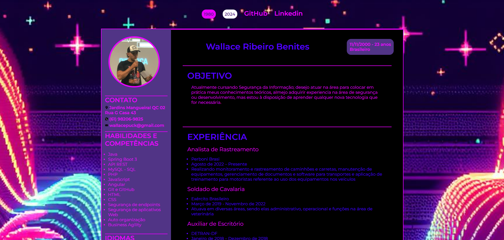

# Currículo HTML | Faculdade SENAC DF | Padrões Web

Status: Concluído!

## Sobre o Projeto

---

- Resultado do meu trabalho de Padrões Web 
- Criando um currículo em HTML + CSS
- Foi criado com Web Design Responsivo 


## Principais tecnologias utilizadas 

````
 HTML - CSS 
````
## Funcionalidades
- Mudar de cor de estilos anos 80, para estilo 2024 
- "Easter egg" cachorro mullet

## Imagens Previa 

### ♦ Estilo 80s
<p align="center" >
     
</p>

### ♦ Estilo 2024s
<p align="center" >
     
</p>

### ♦ celular  
<p align="center" >
     
</p>

### ♦ Easter egg aparece ao clicar na idade 
<p align="center" >
     
</p>

Link Vercel 
---
--> [[https://wallaceebenites.github.io/Decodificador/](https://wallaceebenites.github.io/javascrip_decodificador/)](https://html-curriculo-padroes-web-wallace.vercel.app/)
